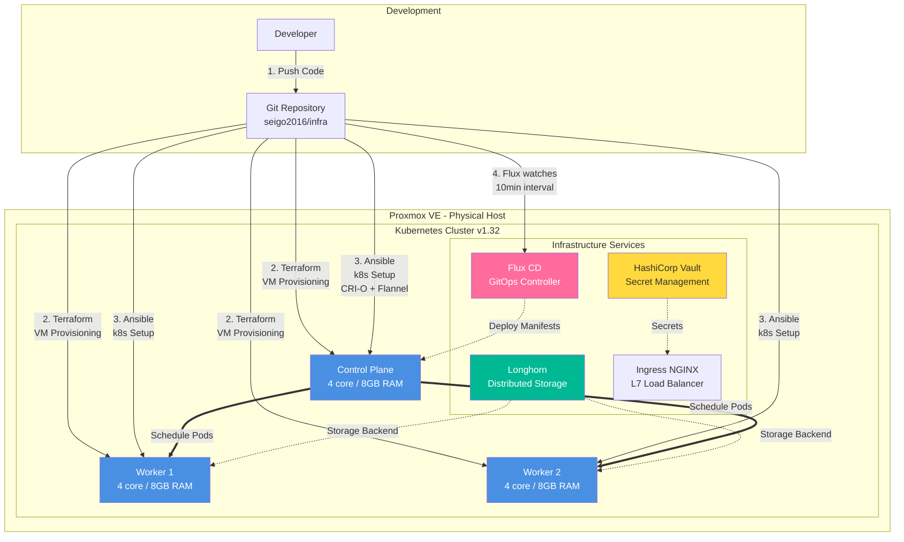

# 自宅サーバー環境 アーキテクチャ図

このドキュメントは自宅サーバー環境プロジェクトのアーキテクチャ図のソースコードを保管しています。

## Mermaid Diagram

## アーキテクチャ概要

- **物理ホスト**: Proxmox VE上で仮想化
- **Kubernetesクラスタ**: v1.32、CRI-O + Flannel CNI
- **IaC**: Terraform (VM構築) + Ansible (k8s構築)
- **GitOps**: Flux CD (10分間隔で自動同期)
- **ストレージ**: Longhorn分散ストレージ
- **シークレット管理**: HashiCorp Vault
- **Ingress**: NGINX Ingress Controller
